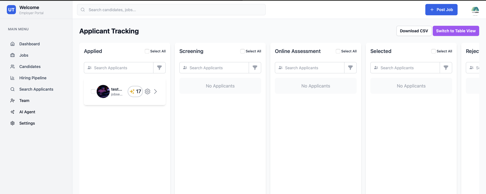
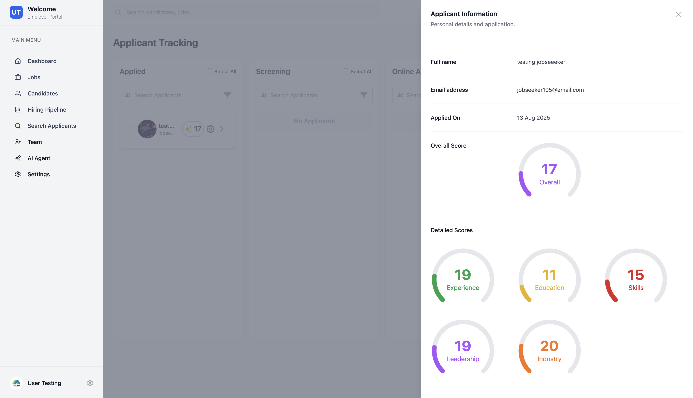
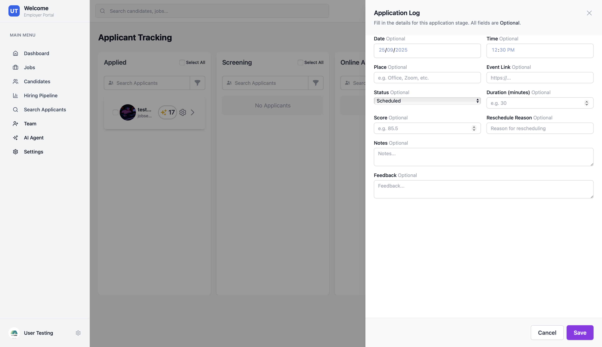

# Application Tracking System (ATS)

Hiregen.com features a robust Application Tracking System (ATS) designed to help employers efficiently manage and track candidates throughout the hiring process. The ATS provides a visual and intuitive interface, making it easy to monitor candidate progress, schedule interviews, and make informed hiring decisions.

## Kanban View for Candidate Progress

The ATS utilizes a Kanban-style board to represent each stage of the recruitment pipeline, such as "Applied", "Screening", "Interview", "Offer", and "Hired". Employers can drag and drop candidates between stages, providing a clear overview of where each applicant stands in the process.

*The screenshot above shows the Kanban board, where each card represents a candidate. This visual workflow helps teams collaborate and ensures no candidate is overlooked.*

## Smart Interview Scores

Hiregen's ATS incorporates smart scoring features to help employers evaluate candidates objectively. After interviews or assessments, candidates receive scores based on predefined criteria, making it easier to compare applicants and identify top talent.

*In the screenshot above, you can see how interview scores are displayed for each candidate, allowing for data-driven decision making.*

## Schedule Interviews Seamlessly

The ATS streamlines the interview scheduling process. Employers can set up interviews directly from the candidate's profile, send calendar invites, and track upcoming interviews within the platform.

*The screenshot above demonstrates the interview scheduling interface, where employers can select dates, times, and interviewers, ensuring a smooth coordination process.*

---

With Hiregen's ATS, employers gain a comprehensive toolkit to manage applications, track candidate progress, evaluate interview performance, and coordinate interviews—all from a single, user-friendly dashboard.
