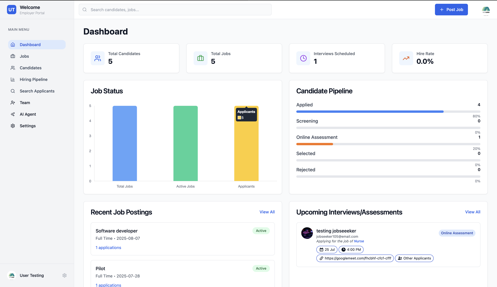

# Employer Panel

Employer panel is a panel where employers can post jobs, manage applications using ATS and our chat agent

### Employer Dashboard
Dashboard is the one page representation of employer stats such as jobs, candidates, hiring success rate, hiring rounds etc.

### Features of Employer Panel
[1.Create and manage Jobs](manage_jobs.md) \
[2.Manage Cnadidates](manage_candidates.md)  \
[3.Application Tracking System](ATS.md) \
[4.Mnage Teams](manage_team.md) \
