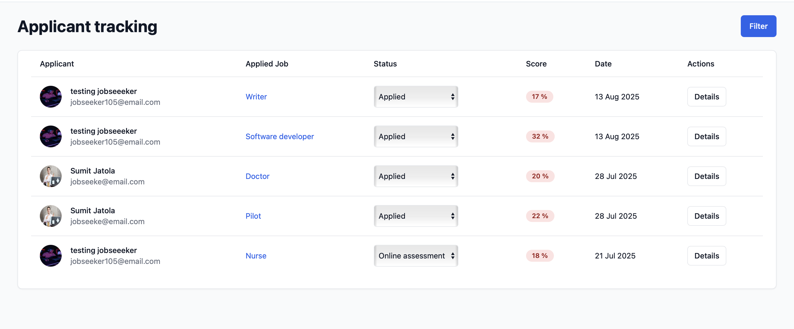
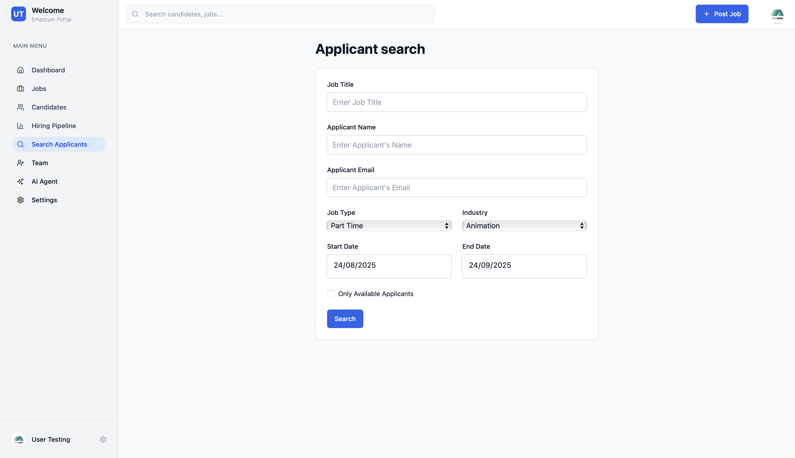

# Manage Candidates

Hiregen.com provides employers with powerful tools to manage candidates who have applied to their job postings. The platform streamlines the entire candidate management process, making it easy to review applications, track candidate progress, and communicate effectively.

## Candidate Management Dashboard

Employers can access a dedicated dashboard that lists all candidates who have applied to their jobs. This dashboard provides key information such as candidate names, application status, job applied for, and quick action buttons to view resumes, shortlist, reject, or move candidates to different hiring stages.

*In the screenshot above, you can see the candidate management interface where employers can efficiently review and take action on each application.*

## Advanced Candidate Search

Hiregen.com also offers an advanced search feature, allowing employers to filter and search for candidates based on various criteria such as skills, experience, location, and more. This helps employers quickly find the most suitable candidates from their applicant pool.

*The search functionality enables employers to pinpoint candidates who best match their requirements, saving time and improving the quality of hires.*

---

With these features, Hiregen.com empowers employers to manage candidates seamlessly, ensuring a smooth and effective hiring process from application to onboarding.
