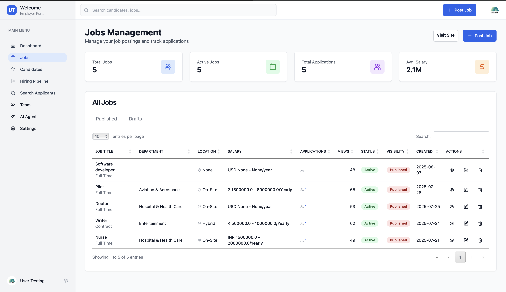
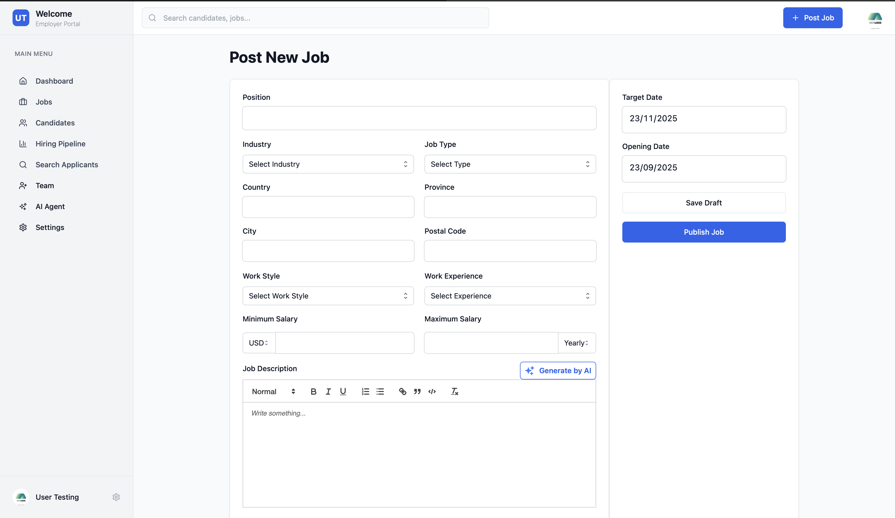
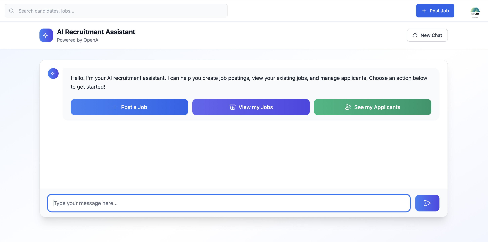

# Manage Jobs

Hiregen.com provides employers with a seamless experience to post new jobs and manage all their job listings from a centralized dashboard. The platform is designed to make the hiring process efficient and intuitive, allowing employers to focus on finding the right candidates.

## All Jobs

The **All Jobs** section gives employers a comprehensive overview of all the jobs they have posted. Here, employers can view, edit, or delete job postings, as well as monitor the status and performance of each job listing.

*In the above screenshot, you can see a list of all jobs posted by the employer. Each job entry displays key information such as job title, status (active/closed), number of applicants, and quick action buttons for editing or deleting the job.*

## Post a Job

Posting a new job on Hiregen.com is straightforward. Employers can fill out a detailed form specifying the job title, description, requirements, location, salary, and other relevant details. This ensures that jobseekers get all the necessary information to apply.

*The screenshot above shows the job posting form. Employers can enter all the required information, select job categories, and set application deadlines. Once submitted, the job will appear in the All Jobs section and be visible to jobseekers.*

## Chat Agent Integration

Hiregen.com features an integrated **Chat Agent** to assist employers throughout the job management process. The chat agent can help with posting jobs, answering queries about job listings, and providing guidance on best practices for attracting top talent.

*The chat agent is available directly within the employer dashboard, offering real-time support and making the job management experience even smoother.*

---

With these features, Hiregen.com empowers employers to efficiently manage their job postings, track applications, and get instant support, all from a single platform.
